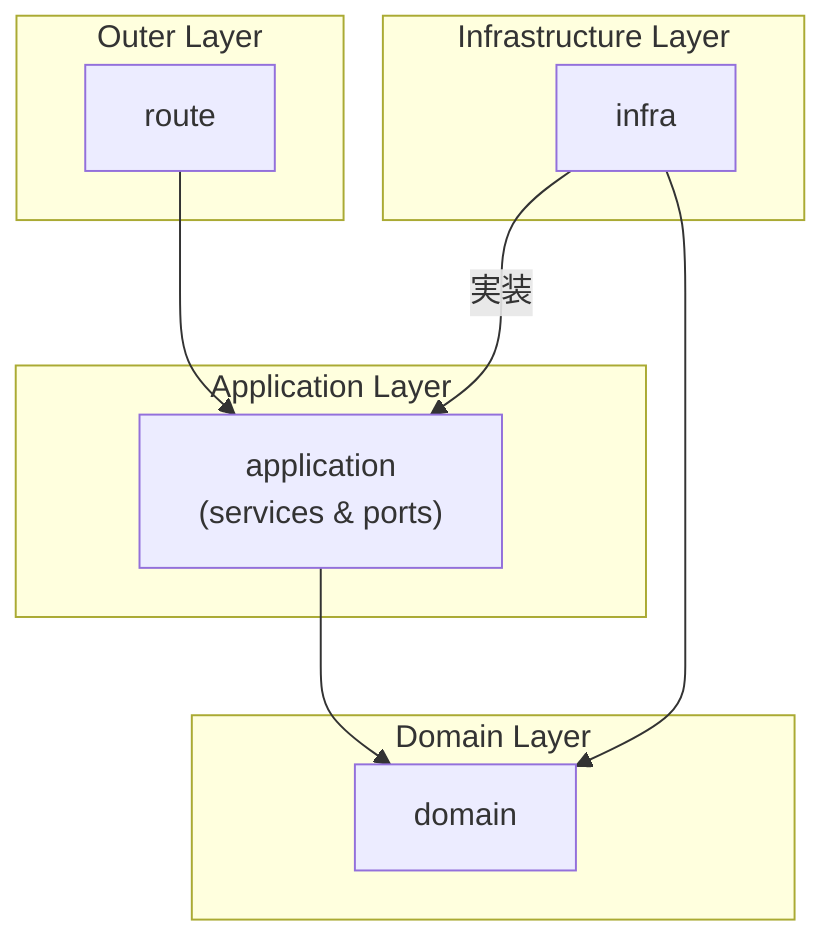

# プロジェクトアーキテクチャと設計思想の概要

このドキュメントは、当Flaskプロジェクトのアーキテクチャ、設計思想、および各コンポーネントの役割について概説します。

## 1. 設計思想: クリーンアーキテクチャ

当プロジェクトは、**クリーンアーキテクチャ**（またはそれに類するレイヤードアーキテクチャ）の原則に強く影響を受けています。主な目的は、関心の分離（SoC）を徹底し、ビジネスロジックをフレームワークやインフラストラクチャの詳細から独立させることです。

これにより、以下のメリットが生まれます。

- **テスト容易性**: ビジネスロジックをUIやデータベースから切り離して単体でテストできます。
- **保守性**: 各レイヤーが疎結合であるため、一部の変更が他の部分に影響を与えにくくなります。
- **柔軟性**: 将来的にWebフレームワークをFlaskから別のものに乗り換えたり、データベースをSQLiteからPostgreSQLに変更したりすることが比較的容易になります。

この設計を実現するために、以下の主要な原則を採用しています。

### a. 依存性の逆転の原則 (DIP)

上位のポリシー（ビジネスロジック）は、下位の詳細（インフラ）に依存すべきではありません。両方とも抽象に依存すべきです。

- **ポートとアダプター**: `application/ports` ディレクトリに定義された抽象インターフェース（ポート）がこの原則を具体化しています。例えば、`UserService` は具体的な `UserRepository` クラスに直接依存せず、抽象的な `IUserRepository` インターフェースに依存します。インフラ層の `UserRepository` はこのインターフェースを実装する「アダプター」として機能します。

### b. 依存性注入 (DI)

クラスが必要とする依存オブジェクト（例: `UserService` が必要とする `UserRepository`）を、外部から注入（提供）します。

- **`dependencies.py`**: このファイルが簡易的なDIコンテナの役割を果たします。各コンポーネントのインスタンスを生成し、依存関係を解決して注入することで、コンポーネント間の結合度を下げています。

### c. DTO (Data Transfer Object)

レイヤー間でデータを転送するために特化したオブジェクトを使用します。

- **`application/ports/user_dto.py`**: `UserCreateDTO` や `UserResponse` のようなDTOを定義しています。これにより、ドメインモデル（`User`）がAPIのインターフェースに直接結合することを防ぎ、各レイヤーが必要とするデータだけを過不足なくやり取りできます。

### d. 構造化ロギング

リクエストIDなどのコンテキスト情報を含んだJSON形式のログを出力します。

- **`utils/logging.py`**: `structlog` ライブラリを利用してロギング基盤を構築しています。これにより、分散システム環境でもリクエストの追跡やデバッグが容易になります。

## 2. ディレクトリ構成と各レイヤーの役割

プロジェクトは、クリーンアーキテクチャの同心円に対応するレイヤー構造で構成されています。

```
learn-flask/
├── application/  # アプリケーション固有のビジネスルール
│   ├── ports/      # 依存性逆転のためのインターフェース（ポート）
│   └── services/   # ビジネスロジックを実装するサービス
├── domain/       # プロジェクトの核となるエンティティとビジネスルール
├── infra/        # DB、外部APIなどフレームワークとドライバ
│   ├── repository/ # ポートを実装する具象クラス（アダプター）
│   └── client/     # DBクライアントなど
├── route/        # エンドポイント定義、リクエスト/レスポンス処理
├── utils/        # ロギングなど横断的な関心事
└── dependencies.py # 依存性注入（DI）の設定
```

- **`domain`**:
  - **役割**: 最も内側のレイヤー。ビジネスの核となるエンティティ（例: `User`）と、それに付随する普遍的なビジネスルールを定義します。
  - **依存**: 他のどのレイヤーにも依存しません。

- **`application` (`services` & `ports`)**:
  - **役割**: アプリケーション固有のビジネスロジック（ユースケース）を実装します。ドメインオブジェクトを調整し、`ports` に定義されたインターフェースを通じてインフラ層の機能を利用します。
  - **依存**: `domain` レイヤーにのみ依存します。

- **`infra`**:
  - **役割**: データベースアクセス、外部APIとの通信など、インフラに関わる具体的な実装を担当します。`application/ports` で定義されたインターフェースを実装（アダプト）します。
  - **依存**: `domain` レイヤー、および `application/ports` のインターフェースに依存します。

- **`route`**:
  - **役割**: 最も外側のレイヤー。HTTPリクエストを受け取り、適切なアプリケーションサービスを呼び出し、その結果をHTTPレスポンスとして返します。リクエスト/レスポンスの形式（JSONなど）に責任を持ちます。
  - **依存**: `application` レイヤー（主に`services`とDTO）に依存します。

### レイヤー依存関係図 (Mermaid)



## 3. データフローの例（ユーザー作成処理）

ユーザーを新規作成する際の処理の流れは以下のようになります。

1.  **`route/user.py`**: クライアントからの `POST /users` リクエストを受け取ります。
2.  **DTO Validation**: リクエストボディのJSONデータを `UserCreateDTO` に変換し、`pydantic` によるバリデーションを行います。
3.  **Service Call**: `dependencies.py` を通じて `UserService` のインスタンスを取得し、`add_user` メソッドをDTOを引数にして呼び出します。
4.  **`services/user_service.py`**:
    a. DTOから `User` ドメインオブジェクトを生成します。
    b. `IUserRepository` インターフェースを介して `add_user` メソッドを呼び出します。
5.  **`infra/repository/user_repository.py`**: `IUserRepository` の実装である `UserRepository` が、受け取った `User` オブジェクトをデータベースに永続化します。
6.  **Response DTO**: サービスは、永続化されてIDが採番された `User` オブジェクトを `UserResponse` DTOに変換して `route` レイヤーに返します。
7.  **`route/user.py`**: 受け取った `UserResponse` DTOをJSONにシリアライズし、ステータスコード `201 Created` と共にクライアントに返却します。